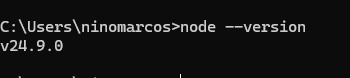
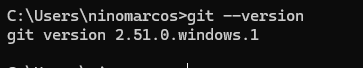
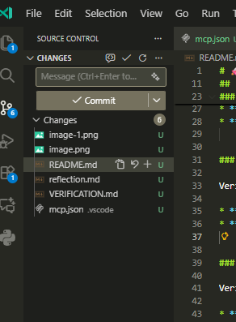
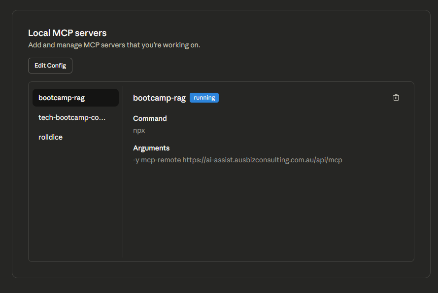
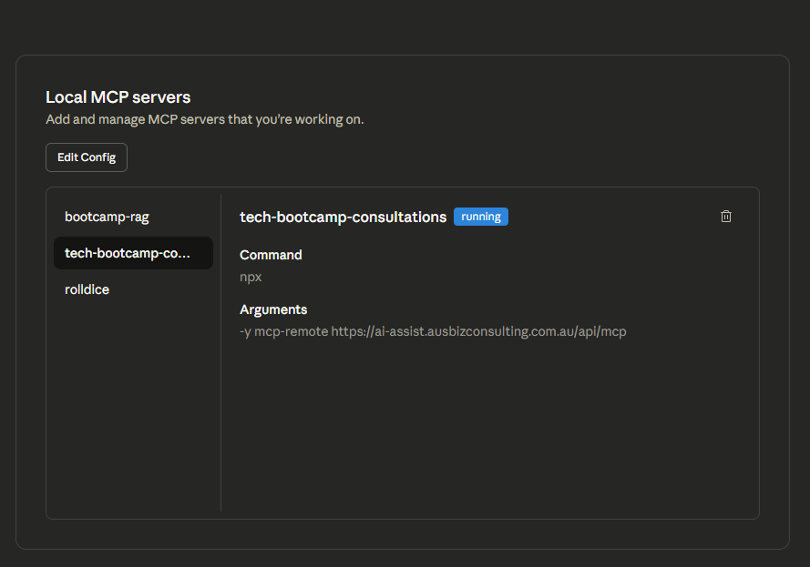
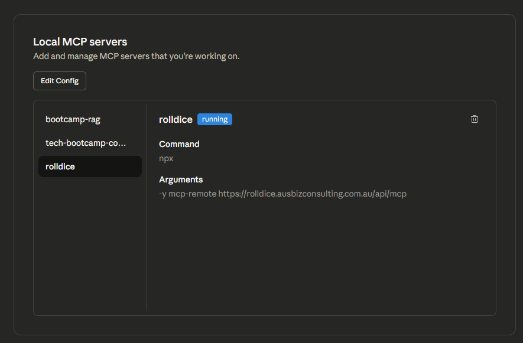

# 🚀 AI Agent Developer Environment Setup Verification

**Repository Name:** ai-agent-dev-setup-[Your Name]

### 👤 Workshop Details

* **Name:** [Your Full Name]

---

## ⚙️ Development Environment Checklist

The following checklist verifies the installation and functionality of the required tools.

### 1. Node.js Installation

Verified the core runtime environment.

* **Command:** `node --version`
* **Screenshot:**
    

### 2. Git Installation

Verified the version control system setup.

* **Command:** `git --version`
* **Screenshot:**
    

### 3. VS Code Insider & GitHub Copilot

Verified the development environment and integrated AI assistance.

* **Status:** Running VS Code Insider with GitHub Copilot enabled.
* **Screenshot:**
    
### 4. Claude Desktop & MCP Connections

Verified the AI agent interface with connectivity to all required servers.

* **Status:** Claude Desktop running with all 4 MCP servers connected and ready.
* **Screenshot:**

---

## 💻 Multi-Channel Protocol (MCP) Server Explanations

### 1. Rolldice
**Purpose and Functionality:** The Rolldice service provides a simple, deterministic API for generating random numbers or simulating dice rolls. Agents use it for testing stochastic behaviors, demos, and reproducible randomness in workflows (for example, simulating choices or sampling during experiments).

### 2. Bootcamp AI Agent
**Purpose and Functionality:** The Bootcamp AI Agent acts as a hands-on example backend that exposes agent capabilities used in the workshop. It mimics a real-world service (APIs, task handlers, or orchestration endpoints) so participants can test integrations, practice requesting agent actions, and validate end-to-end agent workflows.

### 3. GitHub
**Purpose and Functionality:** GitHub provides version-control and collaboration features for the project. For agents, GitHub enables programmatic repository interactions: cloning repositories, creating branches, staging and committing changes, opening pull requests, and automating CI/CD related tasks.

---

## 📝 Troubleshooting Notes

Documented issues encountered during the setup and their resolutions.
No Issues encountered.