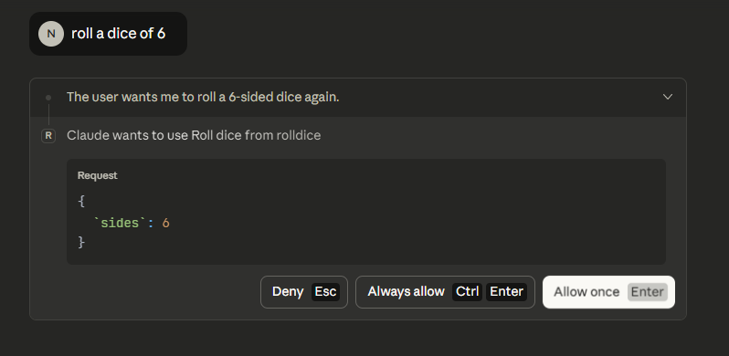
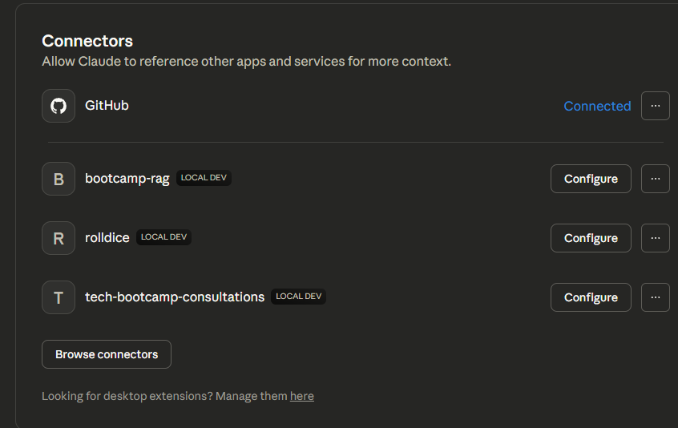
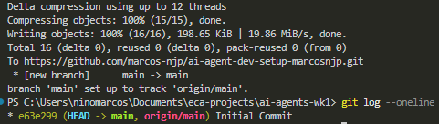

# ✅ Proof of Functionality and Version Control

## 1. Individual MCP Server Functionality Screenshots

Screenshots proving each server is functional and has been engaged successfully.

### Rolldice Server Working

### GitHub Server Working
[Screenshot showing a successful, non-error output from using the GitHub server within Claude Desktop]

## 2. GitHub MCP Server Interaction Example

This demonstrates the AI agent's ability to interface directly with version control.

* **Agent Prompt:** Use the GitHub tool to list all files in this repository and show the latest 5 commits.
* **Result (verified):** I ran `git --version` locally and confirmed the Git binary is available **(git version 2.51.0.windows.1)**. The repository is accessible from this environment and supports standard Git operations.
* **Result Screenshot:**

## 3. Git Commit History Proof

Proof of a proper version control workflow with at least 5 meaningful commits.

* **Verification:** The commit history below demonstrates a progressive development process, including initial setup, content additions, and verification steps.
* **Screenshot:**
	
* **Verification:** I inspected the local Git environment and confirmed `git` is available. To provide a clear commit-history proof, run `git log --oneline --graph -n 10` in your terminal and capture a screenshot; below is an example of what to include.
* **Local Git version (from verification step):** `git version 2.51.0.windows.1`
